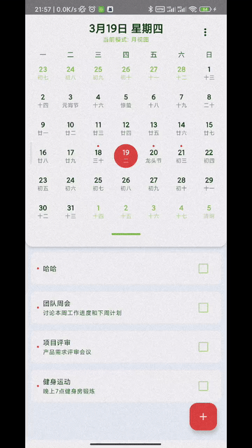
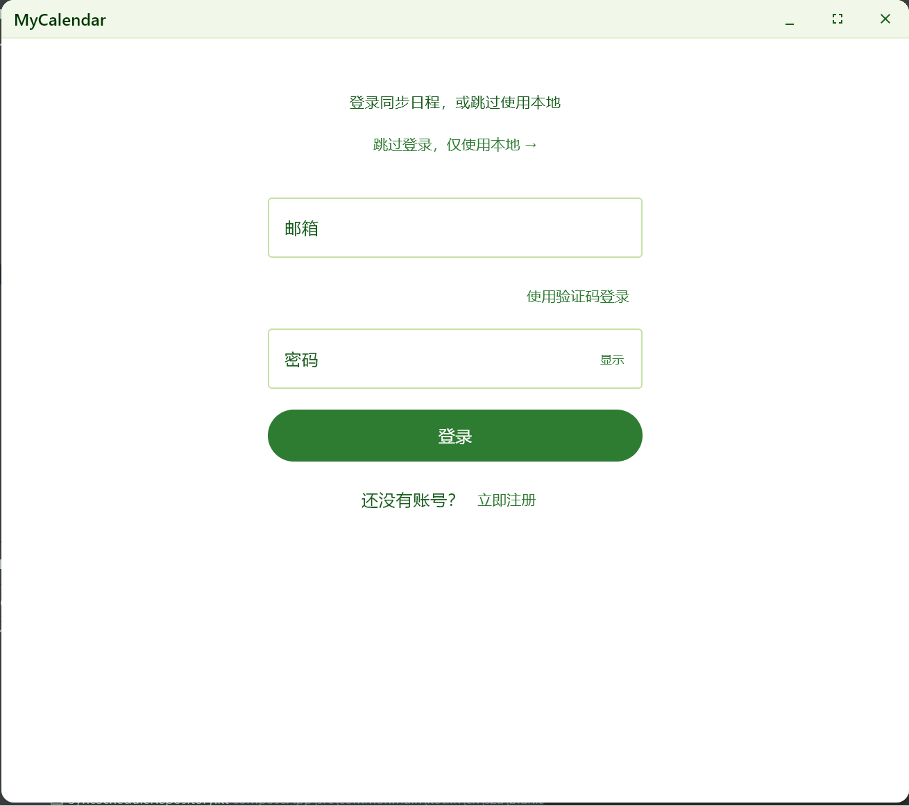

# MyCalendar

基于 Kotlin Multiplatform + Compose Multiplatform 的跨平台日历应用，支持 Android、Windows、iOS。

---

## 演示




---

## 技术栈

| 模块 | 技术 |
|------|------|
| 共享逻辑 (composeApp) | Kotlin Multiplatform、Compose Multiplatform、Room、Ktor、Koin |
| Android (androidApp) | Compose、Navigation、DataStore |
| Desktop (JVM) | Compose Desktop、Skiko |
| iOS | Compose for iOS |

---

## 快速开始

1. 克隆仓库：
   ```bash
   git clone https://github.com/blankxiao/MyCalendar.git
   cd MyCalendar
   ```
2. 用 **Android Studio** 或 **IntelliJ IDEA** 打开项目。
3. 运行：
   - **Android**：选择 `androidApp`，连接设备或模拟器运行
   - **Desktop**：选择 `composeApp`，运行 `run` 任务
   - **iOS**：需 macOS + Xcode，构建 `composeApp` 的 XCFramework 后嵌入 `iosApp` 工程

> 需 JDK 17+，Android SDK 26+。

---

## 项目结构

```
MyCalendar/
├── androidApp/           # Android 壳应用（MainActivity、Application）
├── composeApp/           # KMP 共享模块
│   └── src/
│       ├── commonMain/   # 跨平台共享
│       ├── androidMain/  # Android 专属
│       ├── jvmMain/      # Desktop 专属
│       └── iosMain/      # iOS 专属
└── iosApp/               # iOS 壳工程（Xcode，AppDelegate、Info.plist）
```

---

## 参考

- [yannecer/NCalendar](https://github.com/yannecer/NCalendar)
- [kizitonwose/Calendar](https://github.com/kizitonwose/Calendar)
